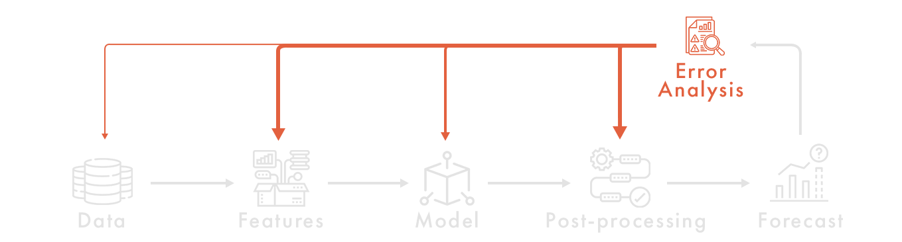

# ErrorAnalysis and AdversarialValidation

Model development, cross-validation, feature generation and selection, and hyperparameter optimization are all important, of course. But it's all just the first step in modeling. As one of the founders of OpenAI said,

Certainly, coming up with new ideas is important, but even more important, to understand the results.

Ilya Sutskever, Co-founder and Chief Scientist of OpenAI
Understanding and analyzing errors is the key to improving the quality of ML service. Even the most advanced models are imperfect, they work better on some data and worse on others (and on some they are completely bad). By figuring out how the current model behaves in each case, "which way" it is wrong, we get a clue what new features we need, what transformations of the target variable, possibly new loesses, or what kind of data we need more of.

When we count a metric on crossvalidation, we aggregate the errors from all the deferred sample objects into a single number, the metric. For example, we count MSE, MAE, MAPE, or, in classification, LogLoss. A point aggregated metric does not give an understanding of how the error is distributed over different objects, what its distribution is, especially what needs to be changed in the collected ML system to correct the error. The metric can only give a hint that things are bad or good, but it does not tell you what it is because of.

Error analysis is the exact opposite process: we take an aggregated metric and break it down into its components. This gives us an indication of where the system is doing well or poorly.

To train neural networks, we use the back-propagation algorithm, back-propagation. The essence of this algorithm is that we take the error gradient layer by layer (from the most recent to the very first). So, error analysis is exactly the same taking a gradient from the target metric, but only for the whole ML system.

## Residuals

### Pseudo-residuals (classification)

If the aggregate loss is represented as:

Than (ylog(p)+(1-y)log(1-p)) represent pseudo-residuals.

### Pseudo-residuals (general case)

### Stat tests
To assess the presence or absence of bias, we compare it to zero using a one-sample t-test.
Verify the normality of the distribution using the Shapiro-Wilk criterion.
There are several tests for homoscedasticity: Bartlett's test, Levene's test, Fligner-Killeen's test

### Diagnostic Plots
Diagnostic Plots is another way to analyze the distribution of residuals, besides statistical tests.
It is a set of specific visualizations of residuals and predictions of the target variable in different sections.

1. Residuals vs. Fitted - it allows us to understand the nature of the bias: whether it is distributed uniformly across all predictions, or whether it has a significant non-uniformity.
2. Normal Q-Q Plot / Normal Q-Q Plot - visualize what the theoretical quantiles of our sample (residuals) would be if it were taken from the assumed distribution, and what the quantiles actually are
3. Scale-Location Plot helps in estimating the scedasticity of the distribution
4. Cook's Distance is a measure of the influence of each individual observation on the model as a whole.

## Residual Fairness

As we can see from the idealized example above, the same metric improvement can be achieved in radically different ways: we prefer that the metric grows a little bit everywhere, rather than a variant in which it grows a lot somewhere and sags somewhere. Therefore, even if the average (aggregated) metric has grown, it is not enough to make a decision to roll a new model into the next A/B experiment.

To avoid this, we must look not only at whether the metric has risen or fallen, but also at how it is spread across all objects (e.g., across all users or across all products). To do this, we introduce the concept of Fairness.

1. Residuals
2. Residuals desrubution (hetero.., normal, unbias)
3. Fairness of destribution
4. Use a machine learning model to analyze a machine learning model by learning an advanced adversarial validation technique in the context of residual analysis.

## Best/Worse-case Analysis

Knowing the residuals, we can analyze how the model behaves in the best case and how it behaves in the worst case. To do this, we trivialize the top-20, top-50, top-100 objects by the size of their residuals and look for commonalities in them.

## Corner Case Analysis

If best/worst case analysis aims to understand which patterns are in the top based on residual values, then corner case analysis solves the opposite problem: what are the residuals of objects with a certain pattern (certain features)?

# Adversarial Validation

Why do models perform well on the training dataset but poorly on the lagged sample (test dataset, target variables to be predicted for).

The first possible reason: models can overtrain on the training dataset (especially if we don't provide reliable validation, based on which we don't just look at whether the metric has increased or not, but also take into account the sensitivity of the chosen scheme; we learned this in KAGGLE: A/B-TEST, where we used statistical tests to decide whether the model improvement was significant or within the margin of error).

The second possible reason: and this is much harder to escape from - the test data set may be significantly different from the training data set. This is what is called "distributional divergence".

To evaluate how similar or dissimilar two distributions are (and in which features exactly), we can train a separate classifier model. All objects in the training sample will take class 0, and all objects in the test sample will take class 1.

If there is no big difference between the samples (e.g., ROC-AUC ≈ 0.5), then we can breathe a sigh of relief and work in a picture of the world in which the distributions of "traine" and "test" do not differ.

If there is a large difference between the samples (e.g., ROC-AUC > 0.6), then the samples are already distinguishable, we can select the most similar objects to the test from the training sample and use them as a delayed validation sample.

This is what is called Adversarial Validation.

1. Residuals
2. Residuals destribution & visualization (normal distrib? )
3. Stat test for bias & norm.distrib evaluation
4. Diagnostic plots
5. Scedacity
6. Residual Fairness
7. Best/Worse-case Analysis & Corner Case Analysis
